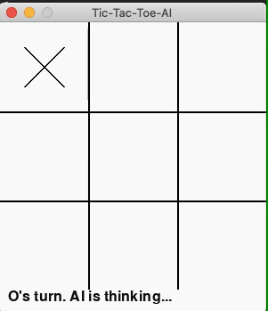

# Tic-Tac-Toe-AI
A Tic-Tac-Toe game made in <b>Pygame</b> where the game plays by itself using <b>AI</b>!

## Overview

AI algorithm used: <b>MiniMax algorithm</b>

About the MiniMax algorithm:

<ul>
<li>Mini-max algorithm is a recursive or backtracking algorithm which is used in decision-making and game theory. It provides an optimal move for the player assuming that opponent is also playing optimally.</li>
<li>Mini-Max algorithm uses recursion to search through the game-tree.</li>
<li>Min-Max algorithm is mostly used for game playing in AI. Such as Chess, Checkers, tic-tac-toe, go, and various tow-players game. This Algorithm computes the minimax decision for the current state.</li>
<li>In this algorithm two players play the game, one is called MAX and other is called MIN.</li>
<li>Both the players fight it as the opponent player gets the minimum benefit while they get the maximum benefit.</li>
<li>Both Players of the game are opponent of each other, where MAX will select the maximized value and MIN will select the minimized value.</li>
<li>The minimax algorithm performs a depth-first search algorithm for the exploration of the complete game tree.</li>
<li>The minimax algorithm proceeds all the way down to the terminal node of the tree, then backtrack the tree as the recursion.</li>
</ul>

## Working Demonstration



## Getting Started

1. Clone this repo
```bash
git clone <this_repo_url>
```
2. Download the required Python packages
```bash
pip install -r requirements.txt
```
3. Run the Python script
```bash
python main.py
```

## References

<a href="https://www.javatpoint.com/mini-max-algorithm-in-ai">Mini-Max Algorithm in Artificial Intelligence</a>

## License

[](https://opensource.org/licenses/MIT)

[MIT License Link](https://github.com/sherwyn11/Tic-Tac-Toe-AI/blob/master/LICENSE)

<br>
© 2020 Sherwyn D'souza
